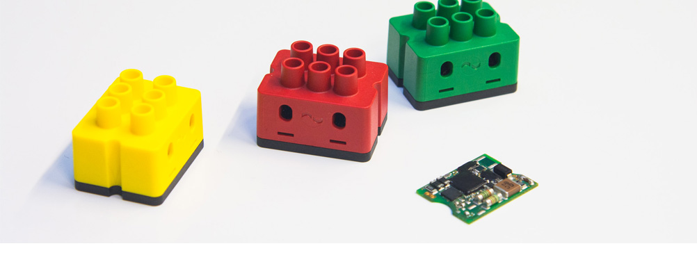



# digitalSTROM Binding

 This binding integrates the [digitalSTROM-System](http://www.digitalstrom.de/).
The integration happens through the digitalSTROM-Server, which acts as an gateway to the digitalSTROM-Devices. The digitalSTROM-Server communicate through the digitalSTROM-Meter with the digitalSTROM-Devices which are directly connected to the power-line.



[picture_source](https://www.digitalstrom.org/wp-content/uploads/2013/12/digitalSTROM-allianz-header-standardisierung.jpg "various digitalSTROM clamps")
## Supported Things

 The digitalSTROM-Server is required as a "bridge" for accessing any other digitalSTROM-Devices.

At this point almost all available *GE*, *SW* and *GR* digitalSTROM-Devices with an set output-mode  unequal *disabled* or *PWM* are supported by this binding. Furthermore the digitalSTROM-Scene concept is part of the digitalSTROM-binding. This scenes are implemented as virtual things.

The following table shows all tested digitalSTROM-Devices with their output-modes

| HW-Type | Output-Mode    | Tested color group  |
|-----------------|------------------------|--------------|----------------- |------------- |
| GE-KL200 | switched | yellow  |
| GE-KM200 |     switched, dimmed | yellow |
| GE-TKM210    | switched, dimmed | yellow |
| GE-SDM200 | switched, dimmed | yellow |
| GR-KL200    | standart output-mode | gray |    
| GR-KL210    | standart output-mode| gray |
| GR-KL220    | standart output-mode | gray |
| SW-KL200    | switch, powersave, wipe | black, yellow |
| SW-UMR200    | single switched, combined switch, combined 2 stage switch, combined 3 stage switch | yellow , black |
| SW-ZWS200    | switch, powersave, wipe | black, yellow |


## Discovery

 The digitalSTROM-Server is discovered through mDNS or *dss.local.* in the local network. Once the server is added as a Thing, you have to set a username and password or insert a valide application-token to authentificate on the server. If the binding is authorized, it automatically reads all supported devices and scenes that are set up on the digitalSTROM-System and puts them into the Inbox.


## Thing Configuration

*digitalSTROM-Server:*
*Verbindungs-Konfigurationen*
Wenn der digitalSTROM-Server nicht automatisch gefunden wird, z.B. weil weil sich der Server nicht im Lokalen-Netzwerk befindet oder mDNS abgeschaltet ist, muss die Netzwerk-Adresse oder URL manuell über die grafische Benutzeroberfläche oder textuell in der \*.thing eingegeben werden. 

| Parameter Label | Parameter ID| Description  | Required | Advanced 
|-----------------|------------------------|--------------|----------------- |------------- |
| Network Address | ipAddress | Network address of the digitalSTROM-Server.| true | false |
| Username | userName | Name of a registered digitalSTROM user to authentificate to the digitalSTROM-Server.| user name and password or application-token | false |
| Password | password | Password of a registered digitalStrom user to authentificate to the digitalSTROM-Server. |
| Application-Token | applicationToken | The application token to authenticate to the digitalSTROM-Server. | user name and password or application-token| false |
| Path to the SLL Certificate | trustCertPath | Here you can specify the path to the SLL certificate for the digitalSTROM-Server. You can download it from digitalSTROM server. Otherwise the SSL certificate will be ignored. | false | false |

*digitalSTROM-Server informations*
The group parameters * digitalSTROM-server informations * only includes informatative parameters which have no special functionality .


| Parameter Label | Parameter ID| Description  | Required | Advanced 
|-----------------|------------------------|--------------|----------------- |------------- |
| digitalSTROM-Sever ID | dSID | The unique identifier of a digitalSTOM-Severs. | false| false |
| Name of the digitalSTROM installation | dsName | The user defined name of the digitalSTROM-installation. | false | false | false |


*General configuration*
Hier können generelle Binding Konfigurationen vorgenommen werden, folgende Tabelle zeigt die Parameter auf:

Here you can set general binding configuration parameters, which shown in following table. 

| Parameter Label | Parameter ID| Description  | Required | Advanced | default |
|-----------------|------------------------|--------------|----------------- |------------- |
| Sensor update interval | sensorDataUpdateIntervall | Sets the Seconds after the digitalSTROM-Device sensor data will be updated. If the priority is higher then 'never'. | false | false | 60 |
| Days to be slaked Trashbin devices | defaultTrashBinDeleateTime| Sets the days after the temporary saved digitalSTROM-Device configuration from not reachable digitalSTROM-Devices get permanently deleted. | false | false | 7 |
| Wait time sensor reading | sensorWaitTime| Waiting time between the evaluation of the sensor values and the reading of the scenes in seconds. ATTENTION: digitalSTROM Rule 8 and 9 require a waiting period of 1 minute. Values less than 60 seconds could affect the digitalSTROM system. | false | true | 60 | 

In the thing file, a manual configuration looks e.g. like

Bridge digitalstrom:dssBridge:dssBridge1 [ ipAddress ="dss.local.",  userName =”dssadmin”, password =“dssadmin” sensorDataUpdateIntervall =”180”]

If the digitalSTROM-server can’t be found automatically for example if the server isn’t located at the local network or mDNS is deactivated, you can insert a network-address or URL manually through the graphical user interface of the paper ui or insert it textual into the \*.thing configuration file. Further you have to set a username and password or a valid application-token. It is possible to deposit   

*digitalSTROM-Devices*
Each digitalSTROM-Device needs the device ID named dSID as configuration parameter. The device ID is printed as serial number on the digitalSTOM-Device and can also be found within the web-interface from the digitalSTROM-Server. 
Furthermore a supported digitalSTROM-Device have at this point only informative parameter.
The following table showed all parameters: 

| Parameter Label | Parameter ID| Description  | Required | Advanced |
|-----------------|------------------------|--------------|----------------- |------------- |
| Device ID | dSID| The unique identifier of a digitalSTOM-Device. | true | false |
| Device UID | dSUID | The unique identifier of a digitalSTOM-Device. With virtual devices. | false | false | 
| Device name | deviceName | he name of a DigitalSTROM-Device. | false | false |   
| Meter dSID | meterDSID | Identifier of the meter in which the device is connected. | false | false |   
| Device hardware type | hwInfo | The hardware type from this digitalSTROM-Device. | false | false |   
| Zone ID | zoneID |The digitalSTROM-Device is part of this zone. | false | false |   
| Group ID's | groups | The digitalSTROM-Device is part of this user-defined or functional groups. | false | false |   
| Device Output mode | outputmode | The current digitalSTROM-Device output mode e.g. 22 = dimmable. | false | false |   
| Device functional color group | funcColorGroup | The current digitalSTROM-Device functional color group e.g. yellow = light. | false | false |   

The GE and SW digitalSTROM-Devices have usually sensors to capture power consumption data. So these devices have the following paramters to read them out.  

| Parameter Label | Parameter ID| Description  | Required | Advanced | Default |
|-----------------|------------------------|--------------|----------------- |------------- |
| Active power refresh priority | ActivePowerRefreshPriority | Set the refresh priority for the active power sensor value. Can be never, low priority, medium priority or high priority. | false | false | never |
| Electric meter refresh priority | ElectricMeterRefreshPriority | Set the refresh priority for the Electric meter sensor value. Can be never, low priority, medium priority or high priority. | false | false | never |
| Output current refresh priority | OutputCurrentRefreshPriority | Set the refresh priority for the output current sensor value. Can be never, low priority, medium priority or high priority. | false | false | never |

The digitalSTROM-scenes can be defined with following parameters.  

| Parameter Label | Parameter ID| Description  | Required | Advanced | 
|-----------------|------------------------|--------------|----------------- |------------- |
| Scene name | sceneName | The Name of a DigitalSTROM scene. | false | false |
| Zone ID or name | zoneID | The digitalSTROM zone id or name of the called scene. 0 or empty is broadcast to all. | false | false | 
| Group ID or name | groupID | The digitalSTROM group id or name of the called scene. 0 or empty is broadcast to all. | false | false | 
| Scene ID | sceneID | The digitalSTROM call scene ID. Callable scenes are from 0 to 127 | false | false | 


Usually the discovery works reliable, so that a manual configuration is not needed.

However, in the thing file, a manual configuration looks e.g. like 

```
Thing digitalstrom:GE-KM200:GE-KM200-1 [ dSID="´3504175fe0000000000043d4",  ActivePowerRefreshPriority=”low”, ElectricMeterRefreshPriority=“medium”, OutputCurrentRefreshPriority=”high”]

Thing digitalstrom:GR-KM200:GR-KM200-1 [ dSID="3504175fe0000000000043d5"]
```

## Channels

All devices support some of the following channels:  

| Channel Type ID | Item Type    | Description  | supported device type |
|-----------------|------------------------|--------------|----------------- |------------- |
| brightness| Dimmer | The brightness channel allows to dimm a light device.  | GE, SW | 
| lightSwitch | Switch | The light switch channel allows to turn a light device on or off. | GE, SW | 
| Combined2StageSwitch | String| The 2 stage light switch channel allows to turn both light devices on or off or switch only 1 of the both light device on or off. | SW-UMR200 | 
| Combined3StageSwitch | String | The 3 stage light switch channel allows to turn both light devices on or off or switch both light devices separated from each other on or off. | SW-UMR200 | 
| shade | Rollershutter | The shade control channel allows to control shade device e.g. a rollershutter or awnings. | GR | 
| generalDimm | Dimmer | The device power control channel allows to control the power of a device e.g. a ceiling fan. | SW | 
| generalSwitch | Switch | The device switch channel allows to turn a device on or off e.g. a HIFI-System. | SW | 
| generalCombined3StageSwitch  | String | The 2 stage device switch channel allows to turn both relais of the ds-device on or off or switch only 1 of the both relais on or off. | SW-UMR200 | 
| generalCombined3StageSwitch  | String | The 3 stage device device channel allows to turn both relais of the ds-device on or off or switch both relais of the ds-device separated from each other on or off. | SW-UMR200 | 
| activePower | Numer | The active power channel indicates the current active power in Watt (W) of the device." | GE, SW | 
| outputCurrent | Numer | The output current channel indicates the current output current in Ampeer (A) of the device." | GE, SW | 
| electricMeter | Number | "The electric meter channel indicates the current electric meter value in killo watts hours (kWh) of the device. | GE, SW | 
| totalActivePower |  | The total power consumption channel indicates the current consuption power in watt (W)  of all connected circuits to the digitalSTROM-System. | dssBridge | 
| totalElectricMeter | Number | The total electric meter channel indicates the current electric meter value in killowatt hours of all connected circuits to the digitalSTROM-System. | dssBridge  | 
| scene | Switch | The scene channel allows to call or undo a scene from digitalSTROM. | Scene | 


## Full Example

demo.things:
```
Bridge digitalstrom:dssBridge:1 [ ipAddress="dss.local.",  userName="dssadmin", password="dssadmin", sensorDataUpdateIntervall=180] {
    GE-KM200 GE-KM200-1 [ dSID="3504175fe0000000000043d4",  ActivePowerRefreshPriority="low", ElectricMeterRefreshPriority="medium", OutputCurrentRefreshPriority="high"]
    GR-KM200 GR-KM200-1 [ dSID="3504175fe0000000000043d5"]
    scene scene1 [zoneID="0", groupID="0", sceneID="5"]
}
```

demo.items:
```
Dimmer Brightness { channel="digitalstrom:GE-KM200:GE-KM200-1:brightness" }
Number ActivePower { channel="digitalstrom:GE-KM200:GE-KM200-1:activePower" }
Number OutputCurrent { channel="digitalstrom:GE-KM200:GE-KM200-1:outputCurrent"}
Number ElectricMeter { channel="digitalstrom:GE-KM200:GE-KM200-1:electricMeter" }

Number TotalActivePower { channel="digitalstrom:dssBridge:dssBridge1:totalActivePower "}
Number TotalElectricMeter { channel="digitalstrom:dssBridge:dssBridge1:totalElectricMeter  "}


Rollershutter Shade { channel="digitalstrom:GR-KM200:GR-KM200-1:shade" }

Switch Scene { channel="digitalstrom:scene:scene1:scene" }
```

demo.sitemap:
```
sitemap demo label="Main Menu"
{
    Frame {
        Slider item=Brightness 
        Switch item= Brightness
        Text item= ActivePower 
        Text item= OutputCurrent 
        Text item= ElectricMeter 
    }
    Frame {
        Text item= TotalActivePower 
        Text item= TotalElectricMeter 
    }
    Frame {
        Switch item=Scene 
    }
    Frame {
        Slider item= Shade 
    }
}
```
